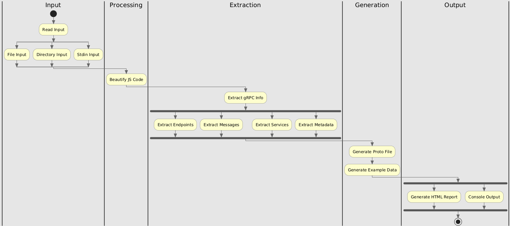
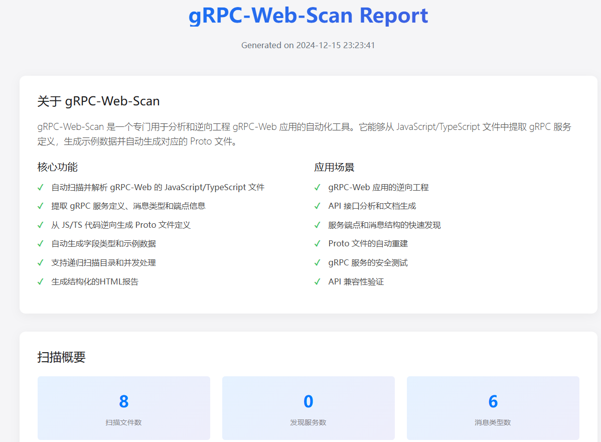
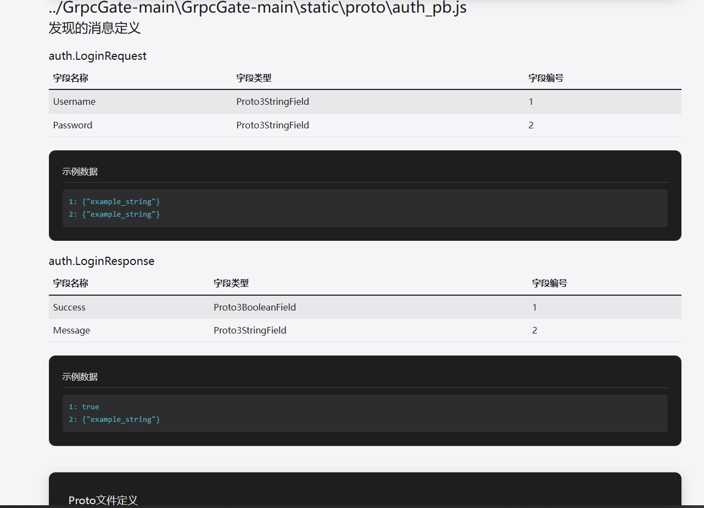

# gRPC-Web-Scan

<p align="center">
  
  <br>
  <em>专业的 gRPC-Web 服务分析与 Proto 生成工具</em>
</p>

<p align="center">
  <a href="#核心特性">核心特性</a> •
  <a href="#安装说明">安装说明</a> •
  <a href="#使用指南">使用指南</a> •
  <a href="#贡献指南">贡献指南</a> •
  <a href="#开源协议">开源协议</a>
</p>

## 项目简介

gRPC-Web-Scan 是一款强大的静态分析工具，专门用于从 gRPC-Web 应用程序的 JavaScript/TypeScript 文件中提取和分析 gRPC 服务定义。它能够自动发现服务、方法和消息类型，并生成相应的 Proto 定义文件和综合性 HTML 报告。

## 核心特性

- 🔍 **智能服务发现**
  - 自动检测 gRPC 服务和端点
  - 支持 JavaScript 和 TypeScript 文件分析
  - 深度递归目录扫描
  - 智能服务关联分析

- 🚀 **高性能处理**
  - 多线程并行处理
  - 高效的文件解析与分析
  - 针对大型代码库优化
  - 内存使用优化

- 📊 **全面的分析能力**
  - 服务与方法提取
  - 消息类型推断
  - 字段类型检测
  - 示例数据生成
  - 服务依赖分析

- 📝 **丰富的输出格式**
  - Proto 文件生成
  - 交互式 HTML 报告
  - 语法高亮控制台输出
  - JSON 格式导出

## 安装说明

```bash
# 克隆仓库
git clone https://github.com/yourusername/grpc-web-scan.git

# 安装依赖
pip install -r requirements.txt
```

## 使用指南

### 基础用法

```bash
# 扫描单个文件
python grpc-web-scan.py --file path/to/file.js

# 扫描目录
python grpc-web-scan.py --dir path/to/directory

# 生成HTML报告
python grpc-web-scan.py --dir path/to/directory --report output.html
```

### 高级选项

```bash
# 自定义工作线程数
python grpc-web-scan.py --dir path/to/directory --workers 16

# 从标准输入读取
cat file.js | python grpc-web-scan.py --stdin
```

## 输出示例

### Proto 文件生成

```protobuf
syntax = "proto3";

package example;

service ExampleService {
  rpc GetUser (GetUserRequest) returns (GetUserResponse) {}
  rpc UpdateUser (UpdateUserRequest) returns (UpdateUserResponse) {}
}

message GetUserRequest {
  string user_id = 1;
}

message GetUserResponse {
  User user = 1;
}

message User {
  string id = 1;
  string name = 2;
  int32 age = 3;
}
```

### HTML 报告预览

<p align="center">
  
    

</p>

## 贡献指南

我们欢迎所有形式的贡献！如果您想为项目做出贡献，请遵循以下步骤：

1. Fork 本仓库
2. 创建特性分支 (`git checkout -b feature/AmazingFeature`)
3. 提交更改 (`git commit -m '添加一些很棒的特性'`)
4. 推送到分支 (`git push origin feature/AmazingFeature`)
5. 开启一个 Pull Request

## 开源协议

本项目采用 MIT 协议 - 详见 [LICENSE](LICENSE) 文件

## 致谢

- 感谢所有为项目做出贡献的开发者
- 感谢 gRPC 社区的支持和帮助
- 基于 Python 和众多优秀的开源库构建

---

<p align="center">
  用 ❤️ 构建，为安全研究者服务
</p>
